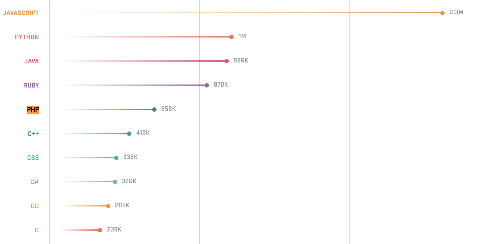

# PHP: Hypertext Preprocessor

---

# History & Numbers

* Created by Rasmus Lerdorf in 1994
* Running on +75% of all web servers
* 5th language on GitHub
([Octoverse 2017](https://octoverse.github.com/))
* 7th language in the world
([TIOBE](http://tiobe.com/index.php/content/paperinfo/tpci/index.html) January 2016)
* 1st language for web development
* Running on +75% of all web servers

# Presenter Notes

Souvent moqués par le reste de la communauté car "vieux" et "pas vraiment objet" et très permissif 

---

# 

    The ten most popular languages on GitHub by opened pull request

# Presenter Notes

The ten most popular languages on GitHub by opened pull request

---

# Getting Started

# Presenter Notes

    sudo apt show php

---

# Getting Started

## Linux

    !bash
    $ sudo apt-get install php5-common libapache2-mod-php5 php5-cli

> [http://php.net/manual/en/install.unix.debian.php](http://php.net/manual/en/install.unix.debian.php)

---

# Getting Started

## Mac OS X

    !bash
    $ curl -s http://php-osx.liip.ch/install.sh | bash -s 7.0

    !bash
    $ curl -s http://php-osx.liip.ch/install.sh | bash -s 5.6

> [http://php-osx.liip.ch/](http://php-osx.liip.ch/)

---

# Getting Started

## Windows

> [http://php.net/manual/en/install.windows.installer.msi.php](http://php.net/manual/en/install.windows.installer.msi.php)

---

# Getting Started

## Docker simple container

    git clone https://github.com/acusset/php-env
    make install

Uses Docker simple container with Apache & PHP 7.1.
It's like a sandbox

---

# RTFM: [http://php.net](http://php.net)
